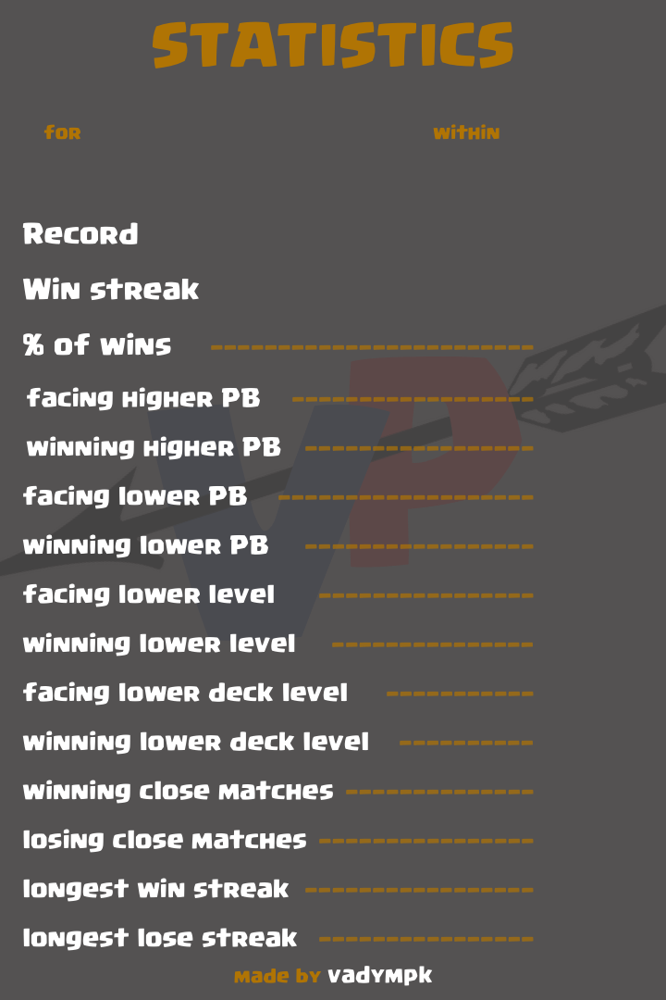
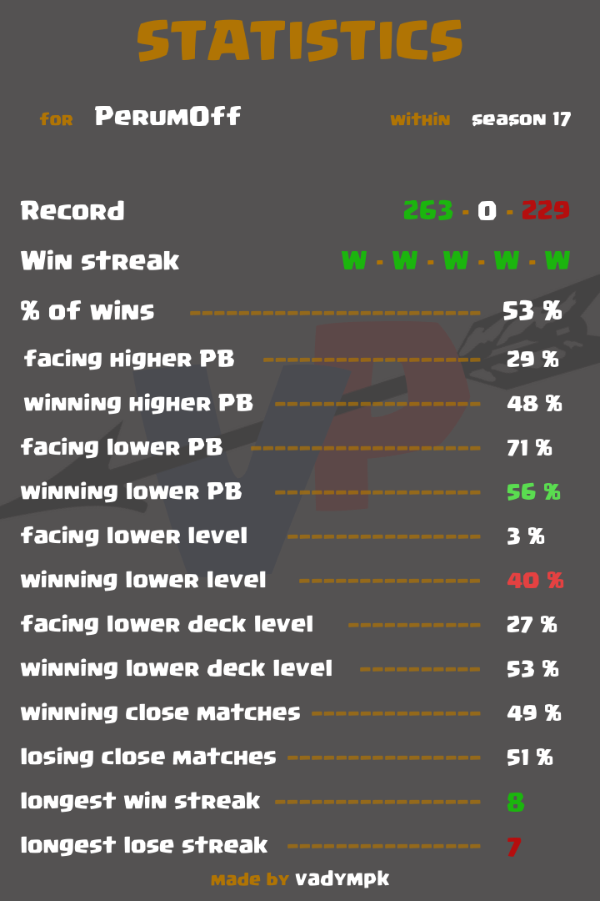

# clash-royale-stats
This project is dedicated to Clash Royale mobile game. 
It can help its players to get statistical data of their activity, which is collected, parsed and compiled automatically. 
It is still in developing stage and works with a database (MongoDB).

## Why am I doing it?
I've been playing Clash Royale for a long time. Recently I've joined the community of this game on Reddit and found out that Clash Royale has its own API.
Then I delved into the study of what can be made with this API. That's when I decided to make a thing that would allow players to understand the game better.  
In fact, that is the first project I did myself, and I really enjoy developing something like this.

## How does it work?
Clash Royale provides an API, which gives an access to a lot of information. This projects uses this API to save players' battles (and a little of other data)
into database (MongoDB). As the API can store only up to 25 battles, the script that saves the data runs automatically every hour on AWS server (server directory).  
And complile_data directory transforms this data into a couple of images. See my [reddit post](https://www.reddit.com/user/vadympk/posts/) if you want to know more.

## Build status
A project fulfills its biggest part, but there are some additional things that can be done:
* compile data for other types of battles (challenge and 2v2). They are being saved into database now. 
* compile seasonal and daily data into something (again, they are already in database).
* create a way to deliver data to players (a bot or something). I could use some help here.

## Used frameworks and tech
* Python
  * urllib (to work with API)
  * pymongo (to work with database)
  * Pillow (to work with images)
* MongoDB

## Sample
The first image is a template, and the second image shows what data are pushed into this template (see compile_data/results/9GC9090GU/season_17 for more samples).  
There is a sketches.sketch file in compile_data/data where I was making all the templates.

